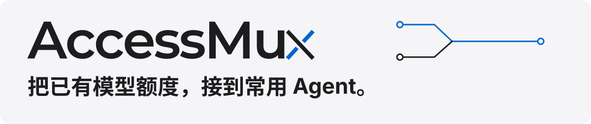
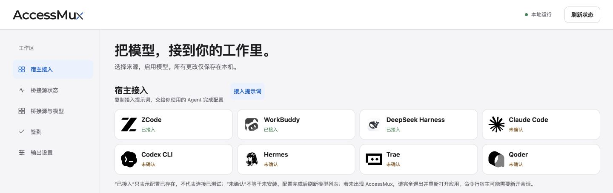

<p align="center">
  
</p>

**AccessMux 把 WorkBuddy、Trae、Qoder、ZCode 和 OpenCode 的模型入口，接到你常用的 Agent。**
额度来自你已有的本机账号，或上游提供的免费档；被桥接的应用不用一直开着。

`0.1.0` · `Node.js 22+` · [MIT 与第三方条款](https://github.com/nengong-ai/AccessMux/blob/main/NOTICE) · [安装手册](https://github.com/nengong-ai/AccessMux/blob/main/INSTALL.md) · [更新记录](https://github.com/nengong-ai/AccessMux/blob/main/CHANGELOG.md)

> **先看边界：** 多数源目前仅支持聊天，不支持完整 Agent 工具任务。AccessMux 不提供额度，也不转卖 Key；免费与优惠随平台变化。

### 把这段话发给本地 Agent

```text
https://github.com/nengong-ai/AccessMux
帮我安装 AccessMux，并接入你自己。
装好后打开本地 UI。
```

Agent 按[安装手册](https://github.com/nengong-ai/AccessMux/blob/main/INSTALL.md)检查来源、识别自己的宿主，只接入当前这一个；不确定时问一次。**当前可用的是 GitHub 源码安装，npm / Release 尚未发布。**

## 看一眼，怎么用

<p align="center">
  
</p>

*实际本地 UI 截图（2026-10-03，裁剪；[放大查看](./assets/readme/local-ui.png)）。卡片的“已接入”表示配置已存在，不代表模型调用已验证。*

装好后，在本地网页启用来源、勾选模型，再把“接入提示词”交给你使用的 Agent。页面和弹窗不用选宿主，收到提示词的 Agent 识别并配置自己。

支持显示名的宿主可显示 `AccessMux ·` 模型名称；**ZCode 原生选择器使用模型 ID，保持原 ID，不做优惠分组。** 配置更新后，已运行的宿主可能需要重新打开或新建会话；客户端里的显示效果以实际结果为准。

## 一个本机端点，连接已有额度

<p align="center">
  
</p>

1. **来源**：本机装好并登录支持的应用；OpenCode 免费档无需账号，但需要官方 CLI。
2. **桥接**：AccessMux 在后台运行，默认端点为 `http://127.0.0.1:8080/v1`。配置页是浏览器里的本地网页，没有桌面 GUI 或 TUI。
3. **使用**：在当前宿主选一个真实可用的模型。**选哪个源的模型，就消费哪个源的额度。** 模型名称与可用性以运行时目录为准。

它适合把散落在不同应用里的额度留在同一套工作流中使用。各源独立适配，某个源失效不会拖停其它源；它补充原生应用的体验，不承诺替代原生能力。

## 支持哪些来源

五类来源、六个独立 adapter；Trae CN 与 Global 分开管理。以下是接入条件，**模型数量、权益和当前费用都以运行时为准**。

| 来源 | 需要什么 | 额度来自哪里 |
| --- | --- | --- |
| **WorkBuddy** | 本机 WorkBuddy 5.6+，已登录 | 自己的 WorkBuddy 账号 |
| **Trae CN / Global** | 对应地区的 Trae IDE，已登录 | 自己的 Trae 账号；CN / Global 独立 |
| **Qoder** | 本机 Qoder 桌面版及其 CLI，已登录 | 自己账号的免费 / 权益额度 |
| **ZCode** | 本机 ZCode 桌面版，已登录 | Start Plan 每日额度与账号权益 |
| **OpenCode** | 官方 opencode CLI，无需登录 | 上游匿名免费模型 |

**使用前要知道：**

- **WorkBuddy**：chat-only。为适配上游 system prompt 指纹检查，桥接会剥离宿主 system 提示词；宿主写在 system 中的行为约定会丢失。
- **Trae**：CN 默认用国内端点，Global 独立开关；不模拟设备级反作弊 header。SOLO 协议会重写 `tools`，不能当作完整工具调用链。
- **Qoder**：chat-only；一个 AccessMux 实例对应一个 Qoder 账号。目录混有免费与权益模型，建议先选已验证的；用量是本地估算，带 `estimated: true` 标识。
- **ZCode**：chat-only；默认保留官方开源 harness 前缀（1253 字符），不改写。目录按账号权益过滤；405 / 3012 返回不可用。因本地工具权限无法可靠限制，app-server 兜底已禁用。
- **OpenCode**：chat-only；隔离运行官方无界面子进程，闲置回收。非真流式，整段回复一次返回；模型随上游变化，无额度计量，回合 token 用量取上游真数。

ZCode Start Plan 官方口径为每日 1 亿 token、当日发放当日过期；是否适用于你的账号，以平台当前权益为准。AccessMux 不保证长期免费或固定模型清单。

<details>
<summary>不用打开原应用，后台实际会起什么？</summary>

| 形态 | 来源与行为 |
| --- | --- |
| 直接 HTTPS | Trae CN / Global、ZCode 默认直连；AccessMux 守护之外不额外启动进程 |
| 瞬时 helper | WorkBuddy 首次解密时调用官方 Electron helper，取得材料后回收，进程内复用 |
| 无界面子进程 | OpenCode 使用隔离的 `opencode serve --pure`，闲置回收；Qoder 每个请求建立全新 CLI 会话，结束回收 |

对应应用须先装好并登录过，OpenCode 除外。零 GUI 指不必打开被桥接应用；安装向导仍会打开 AccessMux 本地网页。

</details>

## 自己安装与接入

推荐直接把上面的仓库链接交给 Agent。自己动手时，先准备 **Node.js 22+**，在一个不存在的新目录取得完整源码：

```sh
git clone https://github.com/nengong-ai/AccessMux.git
cd AccessMux
./install.sh --host workbuddy --yes
```

这里以 WorkBuddy 为例，`--host` 换成**你当前使用的宿主**：`workbuddy`、`zcode`、`dsh`、`claude-code`、`codex`、`hermes`、`trae`、`qoder`。先看计划可用 `./install.sh --host workbuddy --dry-run`；只有明确要接入全部宿主时才用 `--all-hosts --yes`。

向导构建程序、启动或复用后台服务，并打开真实 UI 地址。Agent 有内置浏览器时加 `--no-open-ui`，再打开输出的 `ACCESSMUX_UI_URL`。指引型宿主仍需按提示完成官方配置；打印指引不等于接入成功。已装过只需重跑 onboard，不要再前台启动同端口服务。

**没有登录态，安装也不会凭空得到额度。** 先安装并登录至少一个支持的源，或安装免登录的 opencode CLI。DSH 插件需完整源码目录和源码版 CLI；它不在 npm / Release 运行时包内。

MiniMax Code 已移出 onboard 宿主支持；**MiniMax 模型仍可通过相应来源使用**，以目录为准。其余宿主的具体接法见[宿主接入文档](https://github.com/nengong-ai/AccessMux/blob/main/docs/host-integration.md)，不要仅因能填 Base URL 就推断工具、图片或完整 Agent 协议全部兼容。

## 能力与限制

| 能力 | 当前范围 |
| --- | --- |
| OpenAI | `POST /v1/chat/completions`，流式 + 非流式；源本身的限制仍适用 |
| Anthropic | `POST /v1/messages`，仅非流式；需在 UI 勾选“暴露 Anthropic 兼容端点” |
| 模型目录 | `GET /v1/models`，路由 ID 为 `<adapterId>:<modelId>`，不要把显示名当 ID |
| 图片输入 | 按模型点亮，只有 `supportsImages: true` 才接收；未点亮时明确报错 |
| 工具 / 其它模态 | 多数源 chat-only，不透传 `tools`；不承诺 Responses API、音频或完整 Agent 任务兼容 |
| 本地管理 | 来源开关、模型勾选、上下文、费用与活动、签到状态；“调用待验证”单独显示 |

图片接受 OpenAI `image_url` 与 Anthropic `image` block，支持 http(s) 链接或 base64；单张 5MB、单边 8000px、每请求 8 张。已验证的图片往返包括 ZCode GLM-5.3-Flash、OpenCode、Qoder Qwen3.8-Flash；不把这些结果推广到所有模型。

免费、夜间免费、限时折扣等**活动标签和当前计费分开显示**，不根据标签猜倍率。待更新、未确认和调用待验证也不算免费或已打通。

```sh
# 用实际端口替换 8080；只查看当前模型目录
curl -s http://127.0.0.1:8080/v1/models
```

长请求默认总预算 300 秒、单次输出等待 90 秒；超时会取消本请求的上游工作。可用 `ACCESSMUX_TURN_TIMEOUT_MS` / `ACCESSMUX_IDLE_TIMEOUT_MS` 设置正整数毫秒；控制面探测默认 5 秒。

## 常见问题

**需要注册 AccessMux 或交 API Key 吗？**<br>
不需要。AccessMux 本身免费，不提供 / 倒卖 Key，不做账号共享、代充或拼车。它使用你已有的本机账号或上游免费入口，不替你登录。

**凭据在哪里？**<br>
服务只监听 `127.0.0.1`，主服务校验 loopback Host 和浏览器同源 Origin；内部 shim 使用随机端口与 secret。WorkBuddy / Trae 凭据及 ZCode JWT 在 daemon 进程内存中读取、解密和使用，不返回给浏览器或模型宿主，诊断出口统一脱敏。

shim 与 daemon 同进程，**没有独立凭据进程隔离**；HOME / workspace 重定向也不是操作系统沙箱，不能防御同权限本地恶意程序。本机状态目录可能含凭据副本与可选 Qoder 签到 PAT（`~/.accessmux/qoder.pat`），目录 / 文件权限收紧为 0700 / 0600，更新使用私有临时文件原子替换。**不要上传状态目录或其中的文件。**

**有每日签到吗？**<br>
`accessmux checkin` 支持可用活动的一次性领取（幂等，可挂 cron）。WorkBuddy 季性签到与 Qoder 每日领 Credits 以平台当前活动为准；Qoder 需可选 PAT，用 `accessmux checkin --set-pat` 隐藏输入保存，别放进命令行或日志。ZCode 日常额度自动发放，探测到额外活动时提示去官方客户端领取。[详细说明](https://github.com/nengong-ai/AccessMux/blob/main/docs/host-integration.md)。<br>
Trae 签到需设备身份校验，本项目不提供（月度积分自动发放不受影响）。

**某个源失效了怎么办？**<br>
源独立运行，失效的源从可用模型清单消失，其余源仍可使用。源码更新先停下自己启动的服务，再 `git pull` 并重跑 `./install.sh --host <当前宿主 ID> --yes`，更新后重新启动。也可在配置中关闭对应 adapter，或用 `ACCESSMUX_DISABLE_ADAPTERS=opencode,qoder` 临时禁用。

**怎么撤销接入？**<br>
onboard 写入前会备份，完成清单给出逐宿主回滚命令。完整卸载步骤见[安装手册](https://github.com/nengong-ai/AccessMux/blob/main/INSTALL.md)第 2.7 节；不要让 Agent 盲删状态目录。

## 开发与文档

```sh
npm ci
npm test
npm run typecheck
npm run build
```

`src/` 包含来源适配、协议、路由、CLI 和本地 UI；`tests/` 是离线合成测试，不含真实账号状态；`integrations/dsh-accessmux-connect/` 是 DSH 插件源码。构建产物是 onboard 启动守护的入口；开发时 `npm run dev` 可直跑 CLI。

[安装手册](https://github.com/nengong-ai/AccessMux/blob/main/INSTALL.md) · [接入向导](https://github.com/nengong-ai/AccessMux/blob/main/docs/onboard.md) · [宿主说明](https://github.com/nengong-ai/AccessMux/blob/main/docs/host-integration.md) · [架构](https://github.com/nengong-ai/AccessMux/blob/main/docs/architecture.md) · [发布手册](https://github.com/nengong-ai/AccessMux/blob/main/docs/release-runbook.md)

本地只读检查：`GET /health`、`GET /v1/models`；配置页：`GET /ui`。默认端口 8080，可用 `--port <n>` 或 `ACCESSMUX_PORT` 覆盖。CLI 包含 `serve` / `ui` / `onboard` / `status` / `provider list` / `checkin` / `config init` / `config path`，完整用法见 `node dist/cli/index.js help`。

## 许可与归属

AccessMux 自有代码采用 [MIT](https://github.com/nengong-ai/AccessMux/blob/main/LICENSE)；移植部分保留各自上游条款，详见 [NOTICE](https://github.com/nengong-ai/AccessMux/blob/main/NOTICE)。OpenCode 适配锚定 MIT 许可的官方 opencode 项目。品牌名称与标识仅用于兼容产品识别，不代表关联或背书。

---

**开始用：把[仓库链接](https://github.com/nengong-ai/AccessMux)交给你当前的本地 Agent，说“帮我安装并接入你自己”。**
